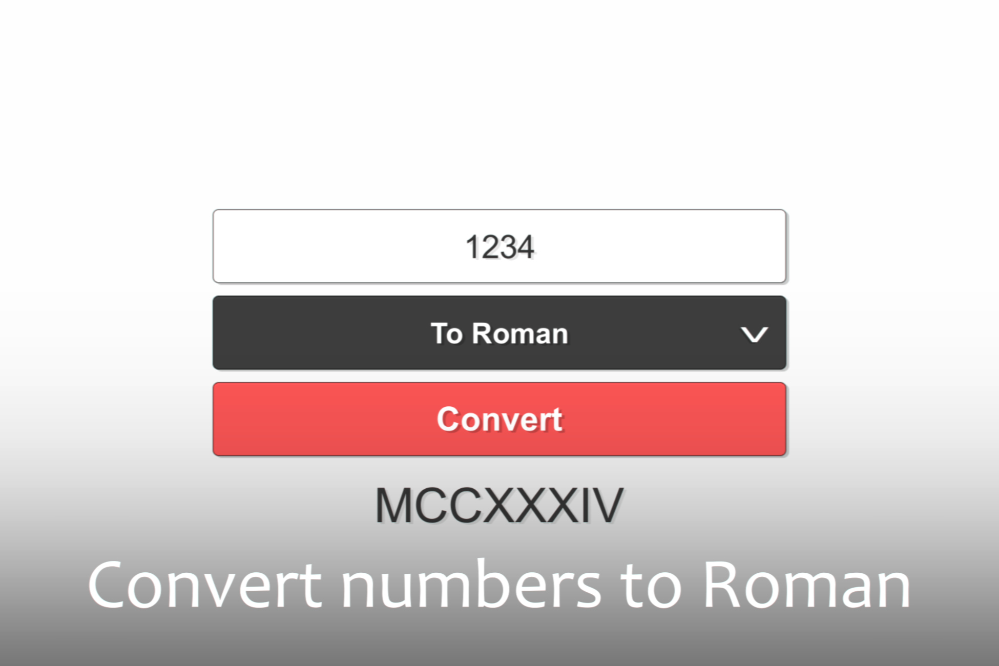

# RomanNumeralMaster
Roman Numeral Master is a universal tool for working with Roman numbers.

📌 This asset provides reliable methods for converting numbers from decimal to Roman and vice versa.

Features:
• Easy to use;
• Fast algorithm;
• Fully commented code.

Supported platforms: Android/IOS/PC

Documentation: Included

🎮 WebGL: https://isleofassets.itch.io/roman-numeral-master

📄 Documentation.pdf: https://drive.google.com/file/d/1Q1MluwquicDQr6Aeu9Si_0MdCphVBqjn/view?usp=sharing

📄 List of available operations on numbers and their parameters: https://drive.google.com/file/d/1EfbNWXfkAT_R07ZvNoWiMtR6wFersTSy/view?usp=sharing

# Screenshots

